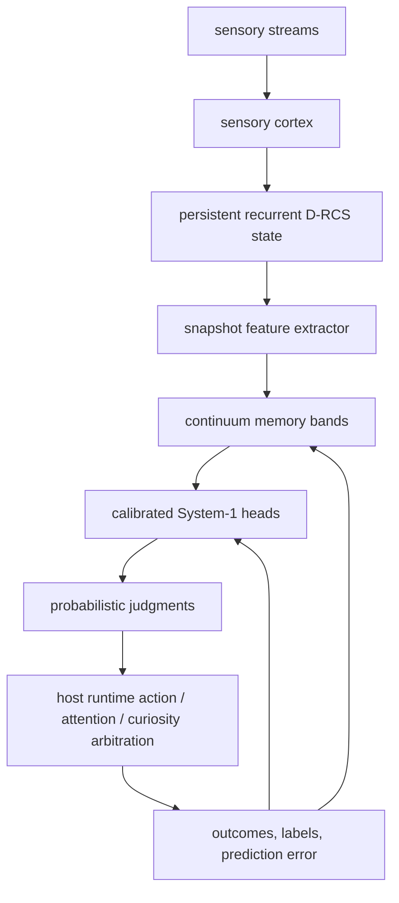

# Nested plasticity + calibrated System-1 integration

## Goal

Add an experimental cognition layer without replacing or reinterpreting the existing recurrent-state model.

The layer combines two engineering ideas:

1. **HOPE/Nested-Learning-inspired plasticity**: several memory bands update at different frequencies, with surprise-gated writes and bounded meta-plasticity.
2. **Jev-inspired System-1 interface**: many small typed binary judgments return probabilities rather than free-form language. Each head is trained online and can use temperature calibration.

This is an architectural experiment, not a reproduction of Google HOPE or TypeSafe Jev.

## Files

- `nested_adaptive_cognition.py` — continuum memory, bounded self-modifying plasticity, calibrated judgment heads, persistence, teacher gate.
- `nested_recurrent_bridge.py` — maps the existing `true_recurrent_dynamics.FEATURES` schema into the additive layer.
- `nested_drcs_runtime.py` — feature-gated adapter for persistent D-RCS runtime snapshots.
- `nested_system1_experiment.py` — deterministic A/B/C/D drift-and-return smoke benchmark.
- `test_nested_adaptive_cognition.py` — memory-timescale, training-isolation, learning, and serialization tests.

## Runtime architecture



This branch supplies the additive layer and the snapshot adapter. The live D-RCS service itself is in the separate `Distributed-Recurrent-Cognitive-System` repository, so this repo does not directly install or restart that service.

## Memory bands

Default bands are intentionally separated by update frequency:

| band | update period | base LR | surprise threshold |
|---|---:|---:|---:|
| immediate | 1 tick | 0.35 | 0.00 |
| working | 4 ticks | 0.16 | 0.08 |
| episodic | 32 ticks | 0.07 | 0.18 |
| identity | 256 ticks | 0.025 | 0.30 |

Each band has a bounded plasticity multiplier. Surprise can raise or lower the multiplier, but it is clamped to prevent runaway self-modification.

Runtime telemetry exposes, per band: write count, update frequency, plasticity multiplier, state magnitude, latest write surprise, and ticks since latest write.

## System-1 judgments

The default bank contains ten independent probabilistic heads:

- prediction_failure
- novel_event
- rewarding_state
- explore
- need_more_information
- teacher_needed
- sensory_conflict
- state_change
- memory_match
- action_success

The core API is deliberately typed and non-linguistic. Labels are optional and are only applied **after** the current-tick prediction has been produced, preventing same-tick target leakage.

Each head persists weights, bias, calibration temperature, training count, cumulative Brier/log-loss metrics, probability bins, and empirical outcome rates. Expected calibration error is computed per head.

## LLM teacher boundary

The layer does not call an LLM. It only exposes:

- `teacher_probability`
- `teacher_gate`

The host runtime decides whether and how to consult an external teacher. Teacher output should return through the normal sensory/learning path rather than directly overwriting recurrent state.

The layer now includes bounded teacher-gate state: threshold, persistent-count gate, cooldown ticks, total consultation count, latest reason, and latest probability.

The layer never calls an LLM and never applies teacher output to memory or recurrent state.

## Feature flags

The D-RCS adapter supports the requested A/B/C/D modes:

| mode | nested memory | System-1 heads | calibration |
|---|---:|---:|---:|
| A | off | off | off |
| B | off | on | on |
| C | on | off | off |
| D | on | on | on |

All modes share the same snapshot feature schema and can be run against the same sensory sequence/checkpoint.

## Checkpoint schema additions

New optional state:

- `memory.bands[*].state`
- `memory.bands[*].plasticity`
- `memory.bands[*].updates`
- `memory.bands[*].latest_write_surprise`
- `memory.bands[*].last_write_tick`
- `system1.heads[*].weights`
- `system1.heads[*].bias`
- `system1.heads[*].log_temperature`
- `system1.heads[*].updates`
- `system1.heads[*].cumulative_brier`
- `system1.heads[*].cumulative_log_loss`
- `system1.heads[*].bins`
- `teacher_gate`
- `pending_training_context`
- `prediction_log`
- adapter `stream_slots`

Legacy checkpoints missing these fields load safely. Corrupted optional nested state fail-safe initializes instead of invalidating the host checkpoint.

## Local verification

The complete unit suite passes 39/39 tests after the runtime-adapter work:

```bash
python -m unittest -v
```

A deterministic smoke benchmark (`seed=8776`, block size 300) produced the following after enforcing delayed labels, so current-row outcomes cannot train current-row predictions:

| variant | accuracy | Brier ↓ | log loss ↓ | B-shift early accuracy | A-return early accuracy |
|---|---:|---:|---:|---:|---:|
| A baseline | 0.7767 | 0.1645 | 0.5029 | 0.1000 | 0.3750 |
| B calibrated System-1 | 0.7956 | 0.1528 | 0.4713 | 0.1500 | 0.4250 |
| C nested memory | 0.7933 | 0.1557 | 0.4814 | 0.1250 | 0.4000 |
| D nested + calibrated | 0.8122 | 0.1447 | 0.4505 | 0.1750 | 0.4250 |

These numbers only characterize the synthetic smoke task. They are not evidence for awareness, consciousness, or physiological validity.

Additional measured calibration/memory telemetry from the same run:

| variant | action-success ECE ↓ | action-success temp. | immediate writes | working writes | episodic writes | identity writes |
|---|---:|---:|---:|---:|---:|---:|
| A baseline | 0.0743 | 1.0000 | 0 | 0 | 0 | 0 |
| B calibrated System-1 | 0.0666 | 0.7272 | 0 | 0 | 0 | 0 |
| C nested memory | 0.0753 | 1.0000 | 900 | 219 | 24 | 2 |
| D nested + calibrated | 0.0697 | 0.7125 | 900 | 206 | 24 | 1 |

## Run

```bash
python -m unittest -v test_nested_adaptive_cognition.py
python nested_system1_experiment.py --seed 8776 --block-size 300
```

## Falsification controls

Downstream runtime experiments should retain controls for shuffled labels, shuffled temporal order, disabled slow memory, frozen plasticity, random judgment heads, uncalibrated heads, disconnected memory readout, disabled teacher gate, randomized/no-op teacher output, and restart during a run.

## Live-runtime integration target

Wire `AdaptiveCognitionLayer` into the persistent D-RCS runtime so that:

1. raw sensory/recurrent features feed the layer every tick;
2. prediction error is supplied from the existing predictor;
3. real outcome labels train only the relevant heads;
4. continuum-memory state is saved in the existing checkpoint;
5. teacher escalation remains external and rate-limited;
6. baseline, System-1-only, nested-memory-only, and combined modes remain feature-gated for controlled A/B/C/D runs;
7. calibration, adaptation latency, catastrophic forgetting, action diversity, winner recurrence, and self-model stability are logged separately.

The separate live D-RCS repository can consume this adapter boundary without replacing its recurrent core. In the local D-RCS runtime integration, the default mode is `A` for backward-compatible behavior, and modes `B`, `C`, and `D` are opt-in runtime flags.
