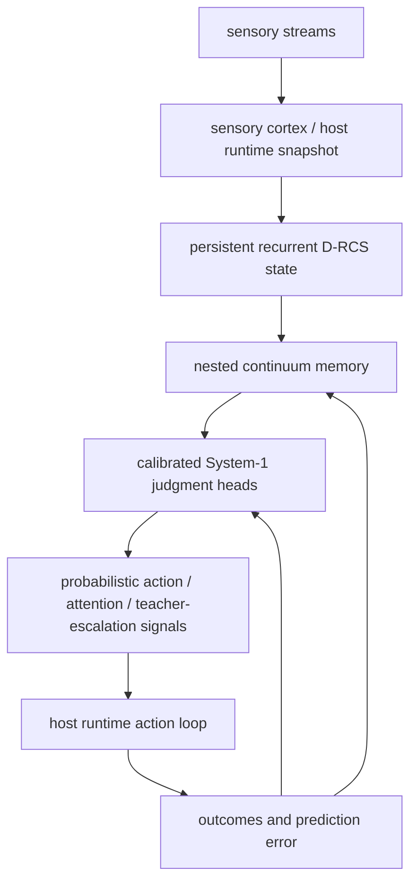

# Awareness Modeling

Adaptive neural regime modeling framework for mapping synthetic and real EEG-like dynamics into functional brain-state regimes using coherence, phase, slow-wave structure, and recurrent state-history tests.

## What this repo does

This project explores whether compact mesoscale features can separate wake-like, NREM-like, and REM-like regimes while tracking candidate loop families such as:

- `thalamo_cortical`
- `fronto_parietal`
- `dmn`
- `ct_cingulate`

The current pipeline supports:

- balanced synthetic wake/N2/REM/N3 generation
- synthetic augmentation and scoring
- regime-map generation in chi/alpha space
- heuristic sleep-state projection
- scoring of real EEG/MRI-style summary rows
- state-specific inertia and directed-transition experiments
- recurrent rollout maps
- deconfounded recurrent-state falsification and ablation tests
- preregistered recurrent parameter-space and robustness auditing
- external human sleep-transition, dwell-time, and perturbation constraint auditing

## Key files

- `balanced_state_generator.py` — balanced synthetic wake/N2/REM/N3 generator
- `asci_pipeline_nompl.py` — synthetic augmentation, scoring, and train/test split
- `regime_map_nompl.py` — binning and regime-map generation
- `sleep_projection.py` — wake/N1-N2/N3/REM projection from regime bins
- `real_data_ingest_nompl.py` — scoring for real or literature-derived summary rows
- `state_specific_inertia.py` — state-memory and directed-transition path tests
- `recurrent_rollout_map.py` — original recurrent rollout-map experiment
- `true_recurrent_dynamics.py` — recurrent state selection with prototype-target deconfounding and falsification controls
- `recurrent_parameter_audit.py` — preregistered six-parameter recurrence sweep, controls, perturbation census, and multi-seed validation
- `recurrent_parameter_audit_core.py` — vectorized audit dynamics and metrics
- `empirical_sleep_constraint_audit.py` — downstream comparison of robust recurrent configurations with published human sleep transition, dwell, and arousal structure
- `nested_adaptive_cognition.py` — additive nested continuum-memory and calibrated System-1 judgment layer
- `nested_drcs_runtime.py` — feature-gated adapter for persistent D-RCS snapshot dictionaries
- `nested_system1_experiment.py` — deterministic A/B/C/D smoke benchmark for nested memory and calibrated heads
- `recurrent_parameter_audit_passing_region.csv` — generated parameter-audit table containing the fully robust marker used by the empirical audit
- `test_true_recurrent_dynamics.py` — unit tests for the recurrent falsification mechanics
- `test_recurrent_parameter_audit.py` — audit/deconfounding/control/classification tests
- `test_empirical_sleep_constraint_audit.py` — empirical-collapse, transition-distance, dwell-fit, and constraint-audit tests
- `MILESTONE_FOUR_STATE_RECURRENT.md` — historical four-state recurrent milestone
- `MILESTONE_TRUE_RECURRENT_FALSIFICATION.md` — deconfounded recurrence milestone and interpretation
- `MILESTONE_RECURRENT_PARAMETER_AUDIT.md` — robust parameter-region milestone
- `MILESTONE_EMPIRICAL_SLEEP_CONSTRAINT.md` — external temporal-constraint milestone and architecture-gap interpretation

## Quick start

The parameter audit uses NumPy for vectorized sweeps:

```bash
python -m pip install -r requirements.txt
python balanced_state_generator.py
python true_recurrent_dynamics.py --input balanced_states.csv --out-prefix true_recurrent
python -m unittest -v test_true_recurrent_dynamics.py test_recurrent_parameter_audit.py
python recurrent_parameter_audit.py --workers 4
python empirical_sleep_constraint_audit.py --robust-configs recurrent_parameter_audit_passing_region.csv
python -m unittest -v test_nested_adaptive_cognition.py
python nested_system1_experiment.py --seed 8776 --block-size 300
```

The parameter audit writes reproducible CSV, JSON, and Markdown outputs including the full parameter sweep, passing region, perturbation sensitivity, multi-seed census, controls, state occupancy, and transition summaries. The empirical audit then tests the fully robust subset against fixed external temporal constraints and writes its own per-configuration CSV, JSON summary, and Markdown report.

## Current interpretation

The synthetic framework can generate separable wake, N2, REM, and N3 feature regimes. The original recurrent rollout map produced strong start-state-dependent endpoint occupancy, but a later falsification test showed that most of that result came from retaining the starting state's feature prototype in the rollout target.

`true_recurrent_dynamics.py` removes that final-target confound and moves previous-state memory into state selection. At its original default recurrent parameters, only a weak residual history effect remains after deconfounding.

The preregistered `recurrent_parameter_audit.py` then tests whether that weak default result is representative of the whole model family. Across 2,430 frozen parameter configurations, 354 configurations survive the deconfounded four-state gates, ±5%/±10% local perturbations, and full-grid validation on at least four of five synthetic seeds. Those robust points occupy about **14.6%** of the tested grid and form connected components of **349** and **5** points.

The strongest boundary is state-memory strength: no fully robust points occur at memory scale 0 or 0.5, only six occur at scale 1, and most occur at scales 2-4. Robust points span every tested transition scale, rollout depth, emission width, temperature, and loop-coupling level.

The defensible model-level claim is therefore:

> The original four-basin result was confounded, the original deconfounded default recurrence is weak, but the deconfounded model family contains a finite and perturbation-stable four-state recurrent region when state-memory strength is sufficiently larger.

A downstream empirical audit now tests all 354 robust synthetic configurations against published healthy-human sleep transition structure, approximate continuous-bout persistence, and an auditory-arousal ordering **without refitting those configurations**. Under frozen direct-match gates, **0/354** configurations match the complete temporal target. The best mean row-wise transition total-variation error is 0.2608 against a 0.20 ceiling, and the best dwell-shape log-RMSE is 0.6496 against a 0.50 ceiling. The largest structural error is N2: healthy-human dynamics favor N2 -> N3, while most robust model configurations favor N2 -> REM under the current standardized probe driver.

The qualitative perturbation ordering is more promising: 343/354 robust configurations make N3 less wake-arousable than N2 and REM. Absolute softmax values are not calibrated event rates, however, and are not treated as literal arousal probabilities.

The current defensible interpretation is therefore two-layered: **the deconfounded synthetic model family contains a robust recurrent region, but that region is not directly temporally calibrated to human sleep architecture under the current uniform alpha/chi driver.** The empirical null exposes a temporal-driver/identifiability gap rather than, by itself, falsifying the synthetic attractor region. Before assigning physiological meaning to the recurrent memory coefficient, the model needs an autonomous temporal layer with empirically constrained stage hazards/survival, higher-order transition history, and circadian/homeostatic drive.

## Nested memory + System-1 integration

The `agent/hope-system1-integration` branch adds an additive nested cognition layer. It does not replace the recurrent state-selection scripts and does not call an LLM for core cognition.



Feature modes are explicit:

| mode | memory | System-1 | calibration |
|---|---:|---:|---:|
| A | off | off | off |
| B | off | on | on |
| C | on | off | off |
| D | on | on | on |

Runtime telemetry from the nested layer includes per memory band: `writes`, `update_frequency`, `plasticity_multiplier`, `state_magnitude`, `latest_write_surprise`, and `ticks_since_latest_write`.

Per System-1 head telemetry includes update count, mean Brier score, mean log loss, calibration temperature, predicted probability bins, empirical rate per bin, and expected calibration error.

Checkpoint state now includes memory-band state/plasticity/write counters, head weights/biases/temperatures/calibration bins, delayed training context, teacher-gate cooldown state, prediction logs, and adapter stream-slot mappings. Missing or corrupted optional nested state is fail-safe initialized instead of invalidating legacy checkpoints.

The adapter preserves stream identity by assigning stable slots to stream names from persistent D-RCS snapshots. It computes cross-stream conflict from per-stream novelty/prediction-error disagreement instead of prematurely collapsing streams into one scalar.

The teacher boundary remains external. The nested layer can expose `teacher_probability`, `teacher_gate`, and `teacher_reason`; it never calls an LLM and never permits teacher output to overwrite identity memory, recurrent state, or chosen actions.

Measured smoke benchmark results on `python nested_system1_experiment.py --seed 8776 --block-size 300`.
The benchmark now uses delayed labels: each row's outcome trains only after that row's prediction has been logged.

| variant | accuracy | Brier ↓ | log loss ↓ | action-success ECE ↓ | action-success temperature |
|---|---:|---:|---:|---:|---:|
| A baseline | 0.7767 | 0.1645 | 0.5029 | 0.0743 | 1.0000 |
| B calibrated System-1 | 0.7956 | 0.1528 | 0.4713 | 0.0666 | 0.7272 |
| C nested memory | 0.7933 | 0.1557 | 0.4814 | 0.0753 | 1.0000 |
| D nested + calibrated | 0.8122 | 0.1447 | 0.4505 | 0.0697 | 0.7125 |

Memory writes in the same run demonstrate distinct timescales:

| variant | immediate | working | episodic | identity |
|---|---:|---:|---:|---:|
| C nested memory | 900 | 219 | 24 | 2 |
| D nested + calibrated | 900 | 206 | 24 | 1 |

These results are synthetic engineering checks only. They do not prove awareness, consciousness, or physiological validity.

Falsification controls to retain for downstream runtime work include shuffled labels, shuffled temporal order, disabled slow memory, frozen plasticity, random judgment heads, uncalibrated heads, disconnected memory readout, disabled teacher gate, randomized/no-op teacher output, and restart during a run.

## Data format

Expected columns for ingest/scoring include:

- `subject_id`
- `state`
- `group`
- `candidate_loop`
- `L_eff_m`
- `v_eff_m_per_s`
- `tau_eff_s`
- `pl_local_aw`
- `pl_global_aw`
- `cfc`
- `w_prop`
- `s_struct`
- `peak_alpha_hz`
- `behavior_awareness_score`

## Disclaimer

This repository is experimental research software. Synthetic/model-internal results are not physiological validation. It is not intended for diagnosis, treatment, anesthesia, consciousness assessment, or any medical decision-making.
